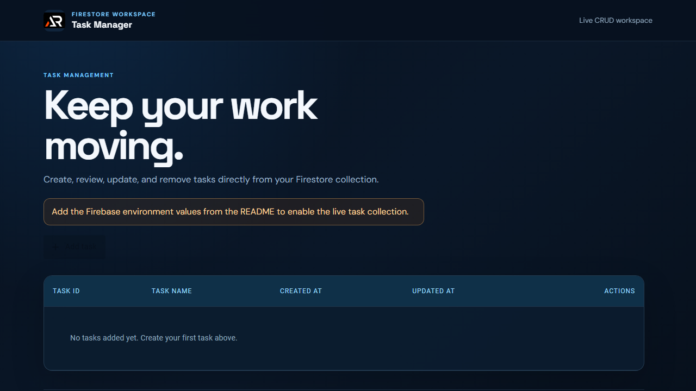

# Firestore Task Manager

A responsive React task manager backed by Firebase Firestore for real-time CRUD operations.

## Features

- Create tasks with a name and description.
- View live Firestore updates in a responsive table.
- View, update, and delete tasks with confirmation feedback.
- Fixed branded workspace header, icon-only footer links, and scroll-to-top control.

## Tech stack

React, Create React App, Firebase Firestore, Material UI, Sass, and SweetAlert2.

## Firebase setup

Create a `.env` file with the Firebase values used by `src/utils/firebase.js`:

```env
REACT_APP_API_KEY=your_api_key
REACT_APP_AUTH_DOMAIN=your_auth_domain
REACT_APP_PROJECT_ID=your_project_id
REACT_APP_STORAGE_BUCKET=your_storage_bucket
REACT_APP_MESSAGING_SENDER_ID=your_sender_id
REACT_APP_APP_ID=your_app_id
```

## Run locally

```bash
npm install
npm start
```

## Deployment

Live app: [https://a2rp.github.io/react.js-fireabase-crud/](https://a2rp.github.io/react.js-fireabase-crud/)

```bash
npm run build
npm run deploy
```



## Links

- Portfolio: [https://www.ashishranjan.net/](https://www.ashishranjan.net/)
- GitHub: [https://github.com/a2rp](https://github.com/a2rp)
- CodePen: [https://codepen.io/ash1198](https://codepen.io/ash1198)
- LinkedIn: [https://www.linkedin.com/in/aashishranjan](https://www.linkedin.com/in/aashishranjan)
- Facebook: [https://www.facebook.com/theash.ashish/](https://www.facebook.com/theash.ashish/)
- YouTube: [https://www.youtube.com/@ashishranjan-ashz?sub_confirmation=1](https://www.youtube.com/@ashishranjan-ashz?sub_confirmation=1)
- Email: [ash.ranjan09@gmail.com](mailto:ash.ranjan09@gmail.com)

## Support

- Support: [https://a2rp-donation-page.netlify.app/](https://a2rp-donation-page.netlify.app/)
- Buy Me a Coffee: [https://buymeacoffee.com/a2rp](https://buymeacoffee.com/a2rp)
- Patreon: [https://patreon.com/a2rp](https://patreon.com/a2rp)
